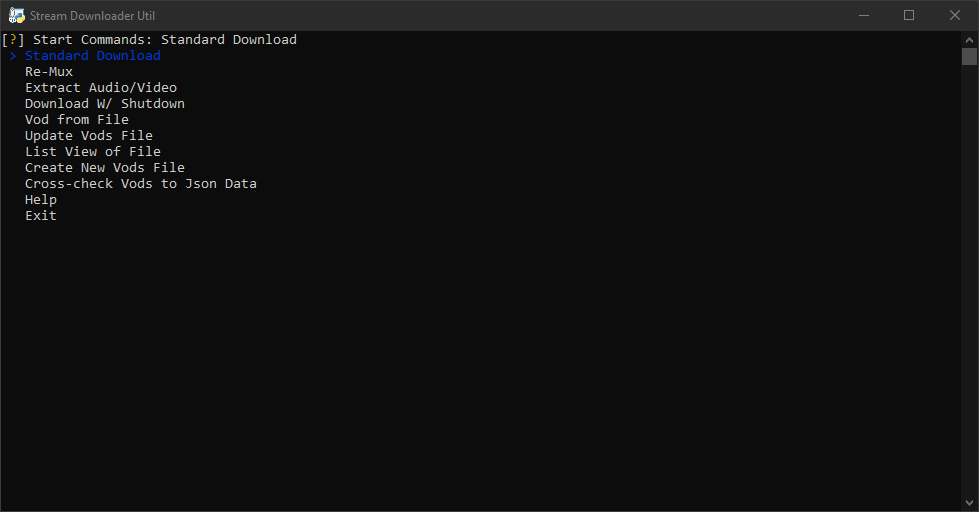
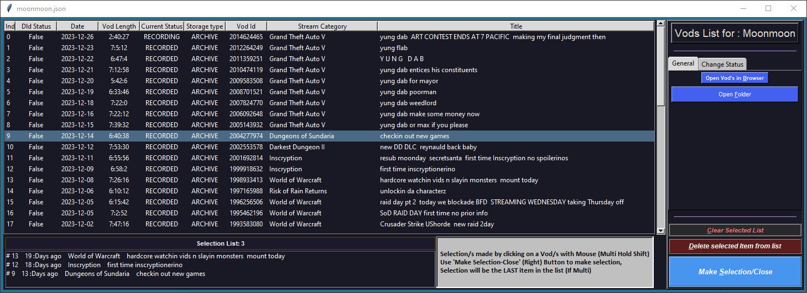

README.md

  

#  **Stream Downloader Util is a Compiled CLI (Onefile) that provides easier Streamlink (Twitch) usage.**

## [Streamlink][streamlink-website] [FFMPEG][ffmpeg] & [FFPROBE][ffmpeg] **DEPENDENT** Downloader

**Main Features**
* Easier Streamlink Download use without need of remembering Streamlink flags/args
* [Muxing](https://forum.videohelp.com/threads/29900-what-is-muxing-and-demuxing) of video files with ffmpeg
* Extraction of Audio & Video Channel/s ([DeMuxing](https://forum.videohelp.com/threads/29900-what-is-muxing-and-demuxing)) from File to separate files
    * Multi channel Files
    * Desire Audio-Video Separated (useful for OBS Multi-Channel Captures)

---

## DOWNLOAD

**STREAMLINK Dependent**

* This python script downloads Media URLs via [Streamlink][streamlink-website]
    * fetches your [clipboard(URL)] OR from user created list (Twitch Streamers Vods)
    * checks if [dependencies] are available & Present, if not, it will ask to download them or provide [links]. 

* It will then retrieve [available] resolutions to download, provides the [fileddialog] (Browser popup) to set save Location/Name.

* Asks what size desired to download with inquirer (Scrollable Arrow keys List).

* Streamlink Flag Twitch-skip-ads and Twitch Auth-Token are avaiable.
    *  Skips [ads] on vods if enabled (trims out the ad time).
    *  if subscribed can record add free Via a [Auth] Token, also enables access to Sub-Only mode Vods.

* (Twitch Vods) Gets Estimated File size of Vod after Resolution Choosen.

* Optional [terminate] Download early without Crashing the CLI 

* Downloads File Via [Streamlink][streamlink-website]

* Asks if [Mux-ing] is Desired (Combines Chunks files for smooth playback with FFMPEG).

---
## MUX-ING

**FFMPEG Dependent**

* This is available after Download And Separate From the main downloading option, can be used as a standalone 

* Re Mux's (Copies) the File specified in the Clipboard (File path) or [fileddialog][fileddialog2] (Browser popup Finder) 

* Sends the old file to the Recycle bin and saves a new file into a separate new Folder inside the CWD, then opens the folder.

---
## EXTRACTION

**FFPROBE Dependent**

Checks if FFPROBE is Available on your C Drive, if not found will be Downloaded From [FFMPEG Website][links],
FFPROBE is needed to check the amount of Channels in the file.

Will Probe the File specified in the Clipboard (File path) or [fileddialog][fileddialog2] (Browser popup Finder) for the amount of audio channels and will return a list of them.

A specific Channel or all channels can be selected. Again will create a Folder within CWD to save files to.

Video can be selected to also Separated form Audio

> VP9/Opus (YouTube Video) is available but will stay in VP9/Opus Codec when extracted, otherwise Re-encoding would be required.

> ***if the file has not been muxed (or standard file) may result in misread of Audio channels***

---
## Twitch Vod Lists

* Saves a json list of X Vods (in your appdata) to help keep track Downloaded status and to cut out a trip to the Browser.
  * Intended to help for archiving of vods (to say YT etc) but without needing to do all/large chunks of vods at once/mass.
* If fully downloaded (the total Len == specified start - total time OR the original Vod Length) from the File List option the script will change status of "Downloaded" within file to the chosen Resolution.
    * Will count as fully downloaded if you set a specific time to start download form (2hrs into a vod thats 6hrs long the file will be 4hrs, But counts as Fully downloaded) can be changed manually in the Vod UI)
    * If Chosen X Vod from Browser using URL and want to update file Status, can be done manually in the Vod List Opt
       OR Via the 'Cross-Check Vods to Json Data' Opt (File Name Format dependant as Follows:
       StreamerUserName - YYYY-MM-DD StreamVodTitle_Stream Category.mp4/mov/mkv)

* ***Youtube Uploading NOT YET IMPLEMENTED*** would like to implement

### Cross-Check Vods to Json Data
* Checks Media Files from chosen Dir/path if any Files  match any Vods in any Json Streamer File
 (File Name Format dependant as Follows: StreamerUserName - YYYY-MM-DD StreamVodTitle_Stream Category.mp4/mov/mkv)

---
## DEPENDENCIES

- [Streamlink][streamlink-website] Streamlink must be installed or (portable) within the C: Drive, to work properly
    - [FFmpeg][ffmpeg] A Version comes with Streamlink
- [FFprobe][ffmpeg]

### **WHY?**

Made this because i was sick of manually entering a string i had saved into Cmd, Then change for every occasion. All other variations are Pure **CLI** automatable, So i made this CLI lite to combine personal frequently used features.

> ***All streamlink limitations are still enabled***

> (***1st multi file script ever made***)

[streamlink-website]: https://github.com/streamlink/streamlink
[clipboard(URL)]: https://github.com/NSMY/Stream-Downloader-Util/blob/d683041b21d277261a08d3cbba19f119bdab22cc/Main.py#L34
[dependencies]: https://github.com/NSMY/Stream-Downloader-Util/blob/d683041b21d277261a08d3cbba19f119bdab22cc/Main.py#L43
[links]: https://github.com/NSMY/Stream-Downloader-Util/blob/Future-Dev-Features/download_Links.txt
[available]: https://github.com/NSMY/Stream-Downloader-Util/blob/d683041b21d277261a08d3cbba19f119bdab22cc/Main.py#L76
[fileddialog]: https://github.com/NSMY/Stream-Downloader-Util/blob/d683041b21d277261a08d3cbba19f119bdab22cc/funcs.py#L181
[fileddialog2]: https://github.com/NSMY/Stream-Downloader-Util/blob/d683041b21d277261a08d3cbba19f119bdab22cc/funcs.py#L148
[Mux-ing]: https://github.com/NSMY/Stream-Downloader-Util/blob/3a2866f282599293e1ff0aebb8722204713cbf85/mux_vid.py#L57
[ffmpeg]: https://github.com/ffbinaries/ffbinaries-prebuilt/releases/tag/v4.4.1
[terminate]: https://github.com/NSMY/Stream-Downloader-Util/blob/d683041b21d277261a08d3cbba19f119bdab22cc/Main.py#L132
[Auth]: https://streamlink.github.io/cli/plugins/twitch.html#authentication
[ads]: https://streamlink.github.io/cli.html#cmdoption-twitch-disable-ads
